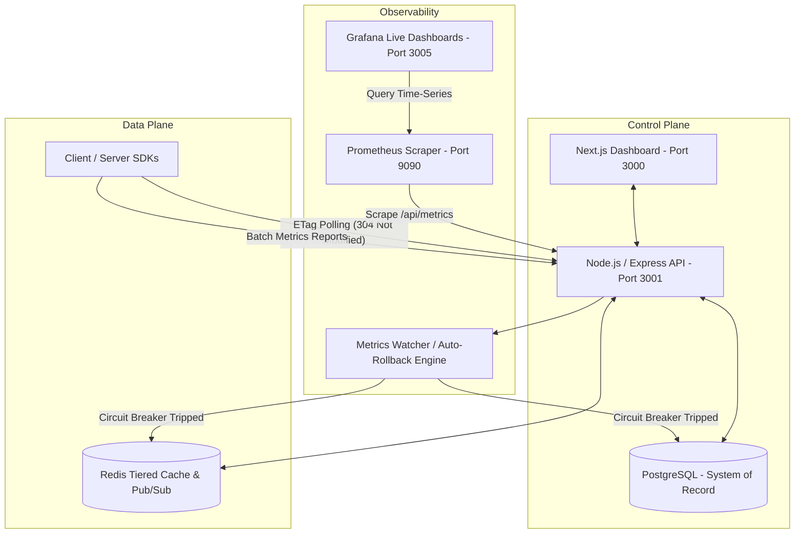

# ⚡ Vanguard — Enterprise Feature Flag Platform

[](https://github.com/Akash-1808/feature-flag/actions/workflows/ci.yml)
[](https://github.com/Akash-1808/feature-flag)
[](LICENSE)
[](https://turbo.build)

**Vanguard** is a universal, ultra-fast, self-hostable feature flag evaluation platform engineered for high availability, zero-latency local evaluations, and automated circuit-breaking.

---

## 🏗️ Architecture & Core Differentiators

Vanguard decouples control-plane management from data-plane evaluation using tiered caching and deterministic hash bucketing:



### ✨ Key Capabilities
- **⚡ ETag Conditional Polling**: SDKs send `If-None-Match` headers. Over 95% of steady-state polls return `304 Not Modified` with near-zero bandwidth payload.
- **🎯 Deterministic MurmurHash3 Bucketing**: User cohorts remain consistent across servers without sticky sessions or reshuffling during rollout increments.
- **🛡️ Fail-Open Caching**: If the central API becomes unreachable, SDKs fall back to local disk/memory cache to ensure your application never breaks.
- **🤖 Auto-Rollback Circuit Breakers**: The built-in `MetricsWatcher` continuously evaluates flag error cohorts. If a flag spike crosses the 5% error threshold, the rollout is automatically disabled within seconds without human intervention.
- **📊 Real-time Observability**: Native Prometheus `prom-client` gauges and pre-packaged dark-mode Grafana dashboards.

---

## 🚀 1-Minute Quick Start (Self-Host via Docker Compose)

You can spin up the entire production stack locally or on your servers using Docker Compose:

```bash
# Clone the repository
git clone https://github.com/Akash-1808/feature-flag.git
cd feature-flag

# Start all services (API, Dashboard, Postgres, Redis, Prometheus, Grafana)
docker compose up -d
```

Once running, access the services:
- **🖥️ Dashboard UI**: [http://localhost:3000](http://localhost:3000)
- **⚙️ Vanguard API**: [http://localhost:3001](http://localhost:3001)
- **📈 Grafana Observability**: [http://localhost:3005](http://localhost:3005) *(Dashboard auto-provisioned)*
- **📊 Prometheus Targets**: [http://localhost:9090/targets](http://localhost:9090/targets)

---

## 📦 Using the SDK (`@feature-flag/sdk`)

### Installation
```bash
npm install @feature-flag/sdk
```

### Server-Side / Client-Side Usage
```typescript
import { VanguardSDK } from '@feature-flag/sdk';

// Initialize SDK with your environment API Key
const vanguard = new VanguardSDK({
  apiKey: 'server_abc123_your_secret_key',
  baseUrl: 'http://localhost:3001',
  refreshIntervalMs: 30000, // ETag conditional polling interval
});

await vanguard.init();

// Evaluate a feature flag with user targeting attributes
const isEnabled = vanguard.evaluate('new-checkout-flow', {
  userId: 'usr_998877',
  attributes: {
    country: 'US',
    plan: 'enterprise',
  },
});

if (isEnabled) {
  // Render new checkout experience
}
```

---

## 🧪 Performance & Load Testing (`k6`)

Vanguard includes comprehensive k6 load tests verified under 100 concurrent virtual users:

```bash
# Run Flag Evaluation Latency Test (~300+ req/sec)
docker run --rm -i -v "${PWD}/k6:/scripts" -e BASE_URL="http://host.docker.internal:3001" -e API_KEY="your_api_key" grafana/k6 run /scripts/evaluation-latency.js

# Run ETag Polling Efficiency Test (>95% 304 ratio)
docker run --rm -i -v "${PWD}/k6:/scripts" -e BASE_URL="http://host.docker.internal:3001" -e API_KEY="your_api_key" grafana/k6 run /scripts/polling-efficiency.js
```

---

## 🛠️ Monorepo Structure

```
├── apps/
│   ├── api/          # Express/Node.js backend API + Auto-rollback engine
│   └── dashboard/    # Next.js 15 App Router Management Dashboard
├── packages/
│   └── sdk/          # Universal TypeScript SDK (@feature-flag/sdk)
├── infra/
│   ├── prometheus/   # Prometheus scrape configs
│   └── grafana/      # Auto-provisioned dashboards & datasources
└── k6/               # High-concurrency performance benchmark scripts
```

---

## 📝 License

Distributed under the MIT License. See [`LICENSE`](LICENSE) for more information.
